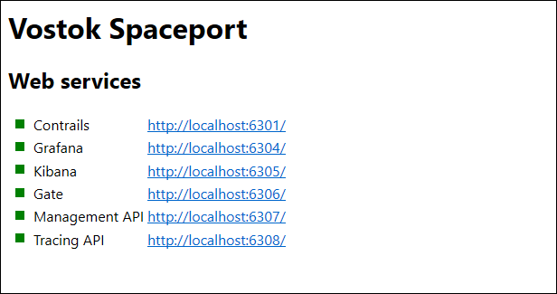
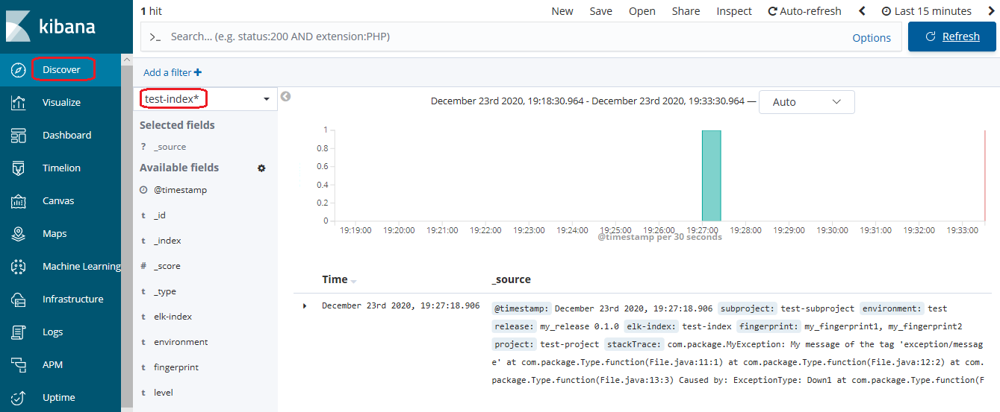
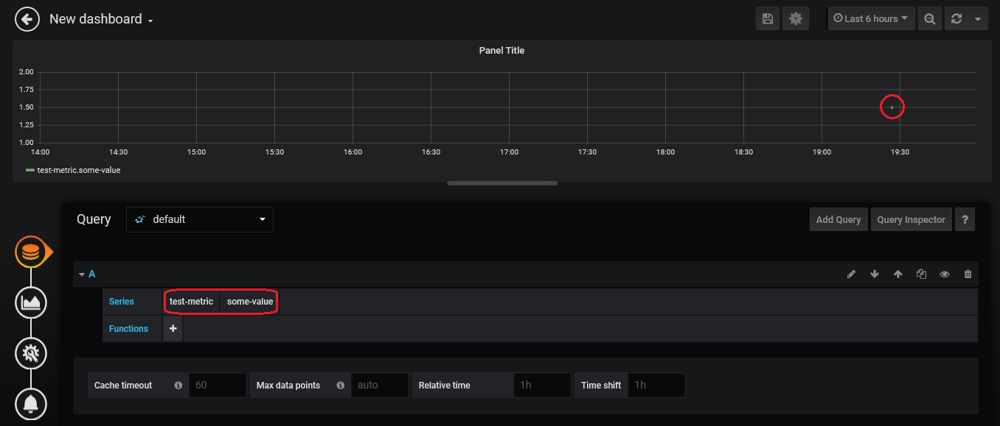
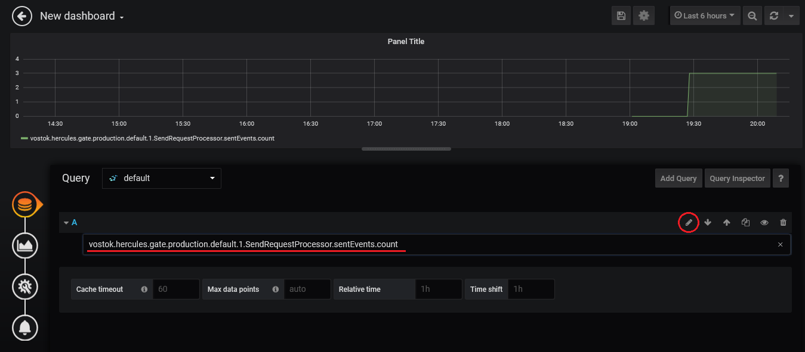
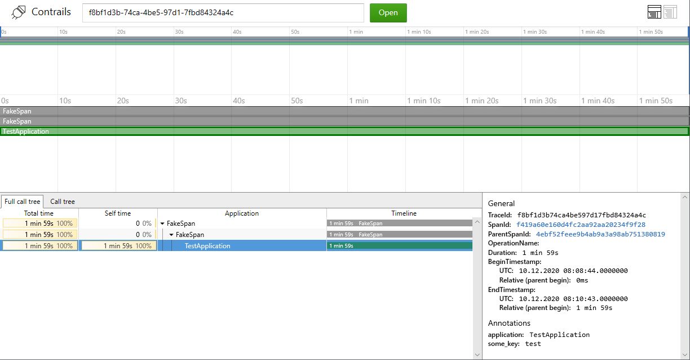

# Spaceport

Spaceport is used to run Hercules and its infrastructure on a single host for development purposes.

[Hercules ](https://github.com/vostok/hercules)
is a system for reliable delivery of telemetry events from microservices to storage and analytics engines.
Spaceport contains Hercules components and infrastructural services
which are configured to work with each other out-of-the-box.

Hercules contributors can also use Spaceport to fix bugs or develop new Hercules components.

## Interface description

[Gate](https://github.com/vostok/hercules/tree/master/hercules-gate) is an entrance of Hercules for telemetry events.
Gate has http API.

There are several event types which are used for handling in Spaceport: logs, metrics and traces.

- Hercules delivers log events to [Elasticsearch](https://www.elastic.co/elasticsearch/) -
search engine for collecting and storing logs.
You can see these log events in web application [Kibana](https://www.elastic.co/kibana).

- Hercules delivers metric events to [Graphite](https://graphiteapp.org) - metrics collection and analysis system.
These metric events are visualized in web interface [Grafana](https://grafana.com/).

- Hercules collects trace events to DB. [Cassandra](https://cassandra.apache.org/) is used as trace DB in Spaceport.
Hercules contains [Tracing API](https://github.com/vostok/hercules/tree/master/hercules-tracing-api) for reading traces.
It is http API which returns traces as json.
Spaceport contains web application [Contrails](https://github.com/vostok/contrails.web) for traces visualizing.

You can tune Hercules using [Management API](https://github.com/vostok/hercules/tree/master/hercules-management-api) (http API).

## Installation

[Docker](https://docs.docker.com/engine/installation/) (and `docker-compose`) are prerequisites. Check that you have them in your `PATH`:

```
$ docker --version
Docker version 20.10.0, build 7287ab3

$ docker-compose --version
docker-compose version 1.27.4, build 40524192
```
Go to the directory where the Spaceport project will be located.

Clone this repository:

```
$ git clone https://github.com/vostok/spaceport.git
```

## Usage

### Launch

Go to the root directory of Spaceport project.

You can use utility `make` to run Spaceport. Run the command `make` to download and run all necessary containers. Wait for the command to complete.
The full launch of the services may take another minute.

> **Beware.** You won't be able to run Spaceport on a very old or weak machine. Mid-2014 MacBook Pro with 8GB RAM shows acceptable performance.

Go to [localhost:6300](http://localhost:6300) to check if all components are up and running.
The indicators in front of the component names should be green.



Other commands are also available:

- `make down` will stop and remove all containers
- `make pull` will pull latest versions of containers and overwrite your changes to containers

If you don't have utility `make`, look inside the `Makefile` for commands.

### Web Applications

Spaceport provides several end-user applications.

- [Grafana](https://grafana.com) at [localhost:6304](http://localhost:6304) to explore and plot metrics
- [Kibana](https://www.elastic.co/products/kibana) at [localhost:6305](http://localhost:6305) to explore logs
- [Management API](https://github.com/vostok/hercules/tree/master/hercules-management-api) at [localhost:6307](http://localhost:6307) to manage Hercules
- [Tracing API](https://github.com/vostok/hercules/tree/master/hercules-tracing-api) at [localhost:6308](http://localhost:6308) to see traces as json
- [Contrails](https://github.com/vostok/contrails.web) at [localhost:6301](http://localhost:6301) to visualize traces

## Test

You can test Spaceport work. Go to root directory of Spaceport project and run test script:
```
$ sh test.sh
```

Test script will send one test log event, one test metric event and one test trace event to Hercules.
See below how to check if the Spaceport is working properly.

### Test logs

Go to **Kibana** to see test log event: [localhost:6305](http://localhost:6305).

Create index-pattern if you are for first time in Kibana: go to **Management** menu, then click **Index Patterns** and **Create index pattern**.
Enter `test-index*` and click **Next step**.


Select **@timestamp** as timer filter field on the next step and click **Create index pattern**.

Go to **Discover** menu, then select index pattern: `test-index*`.

If successful, you will see the timing diagram and log event information below.
You can change displayed time period in the upper right corner of the window.



### Test metrics

Go to **Grafana** to see test metric event: [localhost:6304](http://localhost:6304).

Grafana will ask for login and password if you are for first time in Grafana. Entry login: `admin`, password: `admin`.
Then Grafana will ask you to set new password. Entry new or old password.

Click **New dashboard** on new window. Click **Add query** on next window.

Then click **Select metric** in **Series** row on new window.
Select `test-metric` on drop-down list. Then select `some-value` on the right similarly.

If successful, you will see point on the graph.
keep in mind that points may be displayed with a delay of several minutes.



### Hercules metrics

You can see metrics of Hercules components, it may be Gate for example.

Click to the pencil icon on the last Grafana window of test metric.
Entry query: `vostok.hercules.gate.production.default.1.SendRequestProcessor.sentEvents.count`



### Test traces

You can see test trace.

Find line with `traceId` among the logs of test script (look it in the terminal where you have launched test script).
The line looks like this:
```
2020-12-24T08:50:30.292Z [main] DEBUG r.k.v.h.cli.common.EventSamples - Trace event is generated with id: d85f68a3-ba77-404d-8759-4a3c5bfa241a, traceId: f8bf1d3b-74ca-4be5-97d1-7fbd84324a4c
```
Copy value of `traceId` from this line.

Submit request to **Tracing API** with copied value instead of `<traceId>` in sample:
```
curl "http://vm-hercules-sp:6308/trace?traceId=<traceId>"
```
If successful, you will see json with trace information like this:
```
{"result":[{"beginTimestamp":"2020-12-10T11:08:44.000000000+03:00","endTimestamp":"2020-12-10T11:10:43.000000000+03:00","traceId":"f8bf1d3b-74ca-4be5-97d1-7fbd84324a4c","spanId":"f419a60e-160d-4fc2-aa92-aa20234f9f28","annotations":{"application":"TestApplication","some_key":"test"},"parentSpanId":"4ebf52fe-ee9b-4ab9-a3a9-8ab751380819"}]}
```
You can see the trace in **Contrails**.
Go to [localhost:6301](http://localhost:6301). Entry copied `traceId` value.
If successful, you will see diagram. Click to `TestApplication` line to see trace details.



# How to use

###If you want to add new stream
By default, stream name should contains prefix 'logs', 'metrics' or 'traces'. 
Submit request to **Management API** with stream name instead of `<stream name>`:

```
curl -v -X POST 'management-api:6307/streams/create' --header 'Content-Type: text/plain' -H 'masterApiKey: 123' --data '{
    "type": "base",
    "name": "<stream name>",
    "partitions": 1,
    "shardingKey": [],
    "ttl": 86400000
}'
```

###If you want to add new apiKey
Submit request to **Management API** with new apiKey instead of `<apiKey>` and stream prefix instead of `<prefix>`:
```
curl -v -X POST 'management-api:6307/rules/set?key=<apiKey>&pattern=<prefix>*&rights=rwm' -H 'masterApiKey: 123'
```

###If you want to change stream prefix:
To change prefix for logs, edit file
etc\properties\elastic-sink>application.properties.

To change prefix for metrics, edit file
etc\properties\graphite-sink>application.properties.

To change prefix for traces, edit file
etc\properties\tracing-sink>application.properties.

Change prefix in line
```
sink.pattern=metrics
```

###If you want to configure events
Edit properties file:

`etc/properties/gateway-client/log>application.properties` - for logs
`etc/properties/gateway-client/metric>application.properties` - for metrics
`etc/properties/gateway-client/trace>application.properties` - for traces

You can configure:

`gate-client.sender.stream` - stream in Kafka used for events writing

`gate-client.sender.type` - event type. Default value: `log`. Values:
- `log` - log-event for ElasticSearch and Sentry
- `trace` - trace-event
- `metric`- metric-event

`gate-client.sender.apiKey` - API-key of specified stream

`gate=client.sender.url` - URL of Hercules Gate server

`gate-client.sender.eventCount` - event count per sending request. Default value: 1

`gate-client.sender.requestCount` - sending request count. Default value: 1

You can manage your events by changing file `test.sh` or write your own script.
