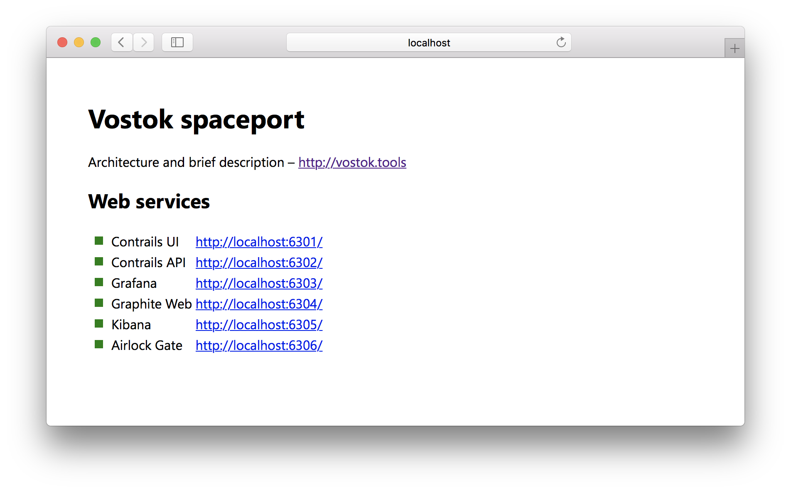

# Spaceport

Spaceport is used to run Hercules infrastructure on a single host for development purposes. It contains all Hercules components which are configured to work with each other out-of-the-box.

Hercules contributors can also use Spaceport to fix bugs or develop new Hercules components.

## Installation

[Docker](https://docs.docker.com/engine/installation/) (and `docker-compose`) are prerequisites. Check that you have them in your `PATH`:

```
$ docker --version
Docker version 19.03.0

$ docker-compose --version
docker-compose version 1.25.5
```

Clone this repository:

```
$ git clone https://github.com/vostok/spaceport.git
```

## Usage

Use `make` to run Spaceport. It will download and run all necessary containers.

**Beware.** You won't be able to run Spaceport on a very old or weak machine. Mid-2014 MacBook Pro with 8GB RAM shows acceptable performance.

Go to [localhost:6300](http://localhost:6300) to check if all components are up and running.



Other commands are also available:

- `make down` will stop and remove all containers
- `make pull` will pull latest versions of containers and overwrite your changes to containers

If you don't have `make`, look inside the `Makefile` for commands.

### Web Applications

Spaceport provides several end-user applications.

- [Graphite](https://graphiteapp.org) at [localhost:6304](http://localhost:6304) to explore and plot metrics
- [Grafana](https://grafana.com) at [localhost:6303](http://localhost:6303) to create dashboards with metrics
- [Kibana](https://www.elastic.co/products/kibana) at [localhost:6305](http://localhost:6305) to explore logs
- [Contrails](https://github.com/vostok/contrails.web) at [localhost:6301](http://localhost:6301)
- [Management API](https://github.com/vostok/hercules/tree/master/hercules-management-api) at [localhost:6307](http://localhost:6307)
- [Tracing API](https://github.com/vostok/hercules/tree/master/hercules-tracing-api) at [localhost:6308](http://localhost:6308)

## Scenarios

### Send test events
For sending test events use next commands:

`docker run --network=host -v <path to application.properties file>:/etc/hercules vstk/hercules-gateway-client:0.38.0-SNAPSHOT`

Example of properties file: [application.properties](etc/properties/gateway-client/application.properties).
